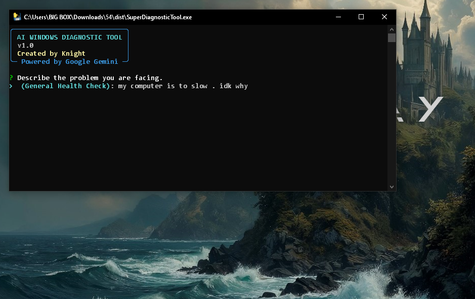
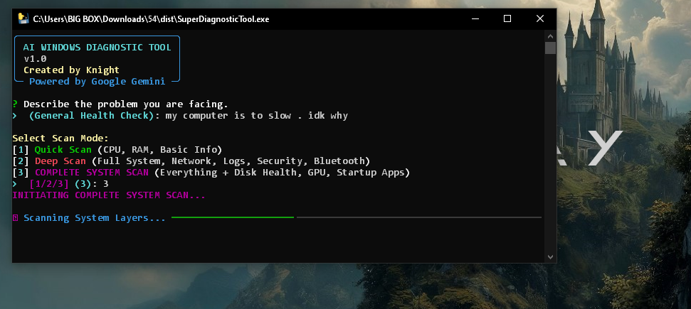

# Super Diagnostic Tool (AI-Powered)
  

**Super Diagnostic Tool** is an advanced Windows system analysis utility that leverages **Google's Gemini AI** to diagnose computer issues, analyze system telemetry, and provide actionable fixes.

*(Screenshot of the main interface)*

## 🚀 Features

*   **🤖 AI-Powered Analysis**: Uses Google Gemini to correlate system data with your problem description.
*   **📊 Real-Time Monitoring**: Live tracking of CPU, RAM, and Battery status.
*   **🛡️ Security Audit**: Checks Antivirus status, Firewall profiles, and recent Windows Updates.
*   **🌐 Network Intelligence**: Analyzes DNS, Wi-Fi signal, and active interfaces.
*   **💾 Disk health**: SMART status and partition analysis.
*   **🔍 Three Scan Modes**: Quick Scan, Deep Scan, and Complete System Scan.
*   **📝 HTML Reports**: Generates detailed, professional HTML reports with findings and AI advice.

## 🛠️ Installation & Usage

### Prerequisites
*   Windows 10 or 11
*   Internet Connection (for AI features)
*   **Google Gemini API Key** (Free)

### Setup Guide

1.  **Download the latest release**:
    Go to the [Releases](https://github.com/Guettaf-hossam/54/releases) page and download `SuperDiagnosticTool.exe`.

2.  **Get your AI Key**:
    *   Go to [Google AI Studio](https://aistudio.google.com/app/apikey).
    *   Click "Create API Key".
    *   Copy the key string (starts with `AIza...`).

3.  **Run the Tool**:
    *   Right-click `SuperDiagnosticTool.exe` and select **Run as Administrator**.
    *   *Why Admin?* This tool needs permission to read system logs, check services, and analyze network adapters.
    *   On the first run, it will ask for your **API Key**. Paste it and press Enter. The key is saved locally in `gemini.key`.

4.  **Diagnose**:
    *   Describe your problem (e.g., "Computer is slow", "Blue screen yesterday", "Wi-Fi disconnecting").
    *   Select a scan mode (Recommend: **Complete System Scan**).
    *   Wait for the AI to analyze your system and generate a report.

## 📸 Screenshots

### Scanning in Progress

### Logic Analysis

### Final HTML Report

## 🔒 Privacy & Security

*   **Your Data**: This tool runs locally on your machine.
*   **AI Privacy**: Only the system telemetry data collected (which you can see in the report) is sent to Google Gemini for analysis. No personal files are uploaded.
*   **Open Source**: The full source code is available here on GitHub for transparency.

## 📄 License
Copyright © 2025 Knight. All Rights Reserved.
This project is for personal and educational use. Unauthorized redistribution or commercial use without permission is prohibited.
