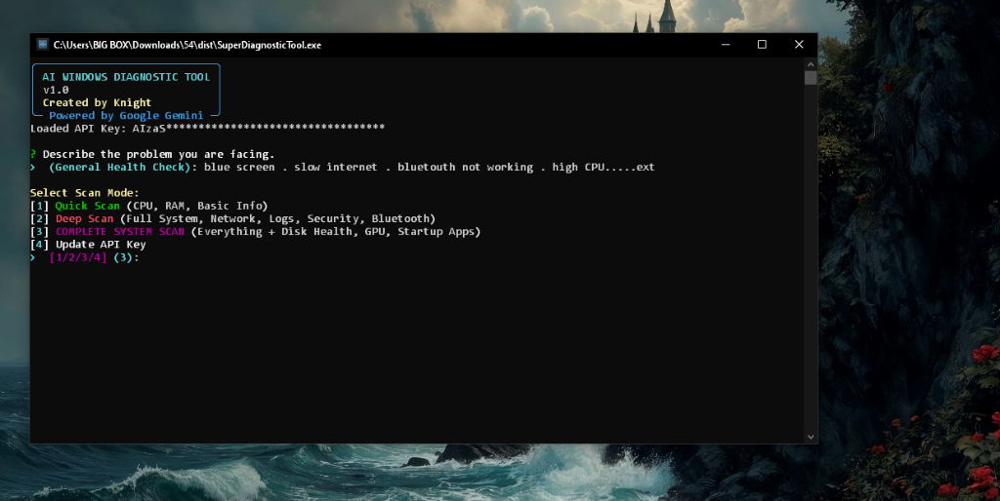

# SuperDiagnosticTool

<p align="center">
  
</p>

<p align="center">
  <strong>AI-Powered Windows Diagnostic & Self-Healing Tool</strong>
</p>

<p align="center">
  <a href="https://github.com/Guettaf-hossam/SuperDiagnosticTool/releases"></a>
  <a href="https://github.com/Guettaf-hossam/SuperDiagnosticTool/blob/main/LICENSE"></a>
  <a href="https://github.com/Guettaf-hossam/SuperDiagnosticTool/stargazers"></a>
</p>

SuperDiagnosticTool is an intelligent system diagnostic utility that combines real-time hardware telemetry with Google Gemini AI to analyze, diagnose, and automatically remediate Windows system issues. Built with a safety-first architecture, it provides production-grade diagnostics for any Windows configuration.

---

## Screenshots

<p align="center">
  
</p>

*Main interface showing scan mode selection and problem description input*

---

## Key Features

### Universal Hardware Support
- **Dynamic Scaling:** Automatically adapts to any CPU configuration (1-128+ cores)
- **Hardware-Agnostic Logic:** Works seamlessly on legacy systems (Intel Pentium) to high-end workstations (AMD Threadripper, Intel Xeon)
- **Graceful Fallbacks:** Safe handling of unsupported features (CPU frequency, battery detection, swap memory)
- **Low-Spec Optimized:** Lightweight execution prevents system lags even on resource-constrained hardware

### Intelligent AI Analysis
- **Google Gemini Integration:** Advanced AI-powered system analysis and diagnostics
- **Context-Aware Recommendations:** Correlates user-reported issues with system telemetry
- **Security Auditing:** Scans for suspicious processes, resource leaks, and potential malware
- **Post-Fix Verification:** Generates completion reports showing what was fixed vs. what requires manual attention

### Safety-First Architecture
- **Admin Privilege Verification:** All remediation scripts include elevation checks
- **PowerShell Variable Sanitization:** Regex-based escaping prevents `InvalidVariableReferenceWithDrive` errors while preserving `$env:` variables
- **Service Safety Checks:** Verifies service existence before attempting stop/disable operations
- **Non-Destructive Operations:** All automated fixes are designed to prevent data loss
- **Error Handling:** Comprehensive try-catch blocks with `-ErrorAction SilentlyContinue` safeguards

### Comprehensive System Scanning
- **Performance Metrics:** CPU usage (overall + per-core), memory breakdown, top resource consumers
- **Network Intelligence:** Active interfaces, DNS configuration, Wi-Fi signal strength, connectivity tests
- **Security Integrity:** Antivirus status, firewall profiles, Windows Update history
- **Hardware Health:** Disk SMART status, GPU information, battery status (laptops)
- **System Services:** Startup applications, failed services, critical event logs
- **Process Auditing:** Identifies suspicious processes based on resource usage and location

### Human-Centric Reporting
- **Professional HTML Reports:** Dark-themed, responsive diagnostic reports with visual metrics
- **Past-Tense Completion Language:** Reports use `[FIXED]`, `[CLEANED]`, `[DISABLED]` tags to show completed actions
- **Manual Attention Section:** Clearly separates automated fixes from items requiring user intervention
- **Timestamped Archives:** All reports saved to `AI_Reports/` directory for historical tracking

---

## Quick Start

### Download

**[Download SuperDiagnosticTool.exe](https://github.com/Guettaf-hossam/SuperDiagnosticTool/releases/latest)** - Standalone executable (no Python required)

### Requirements

- Windows 10 or Windows 11
- Administrator privileges
- Google Gemini API Key ([Get free key](https://makersuite.google.com/app/apikey))

### First Run

1. Download and run `SuperDiagnosticTool.exe`
2. Enter your Google Gemini API key when prompted
3. Describe your system issue
4. Select scan mode (Quick/Deep/Complete)
5. Review AI analysis and remediation script
6. Execute fixes or view detailed HTML report

---

## Installation (For Developers)

### Prerequisites
- Python 3.8 or higher
- pip package manager

### Install Dependencies

```bash
pip install psutil google-generativeai rich
```

### Run from Source

```bash
python super_diagnose_v2.py
```

---

## Usage

### API Key Setup

**Option A: Interactive Input (Recommended for first-time users)**
- The tool will prompt you to enter your API key on first run
- Key is saved locally in `gemini.key` for future use

**Option B: Environment Variable**
```bash
set GEMINI_API_KEY=your_api_key_here
```

**Option C: Manual Key File**
Create `gemini.key` in the same directory:
```
your_api_key_here
```

### Scan Modes

| Mode | Scans | Use Case |
|------|-------|----------|
| **Quick Scan** | CPU, RAM, Basic Info | Fast performance check |
| **Deep Scan** | System, Network, Security, Logs, Bluetooth, Processes | Comprehensive troubleshooting |
| **Complete Scan** | All of the above + Disk Health, GPU, Startup Apps | Full system audit |

### Example Workflow

```bash
# 1. Run the tool
SuperDiagnosticTool.exe

# 2. Describe your issue
> High CPU usage and slow performance

# 3. Select scan mode
> 3 (Complete System Scan)

# 4. Wait for AI analysis
[Scanning system layers...]
[Processing telemetry logic...]

# 5. Review remediation script
[PowerShell script displayed]
> Execute? (y/n)

# 6. View HTML report
> Open detailed report? (y/n)
```

---

## Technical Details

### Code Architecture
- Modular design with separate functions for each diagnostic category
- Comprehensive error handling with try-except blocks
- Hardware-agnostic queries with graceful fallbacks
- Professional docstrings and clear variable naming

### PowerShell Script Generation
- Admin privilege verification before execution
- Regex-based variable escaping to prevent syntax errors
- Environment variables (`$env:TEMP`, `$env:PATH`) preserved correctly
- Safe service management with existence checks
- Error suppression using `-ErrorAction SilentlyContinue`

### Gemini AI Integration
- Structured prompts for consistent output parsing
- Delimited sections (`[ANALYSIS_START]`, `[FIX_START]`) for reliable extraction
- Context-aware analysis based on system telemetry
- Past-tense reporting for completed remediation actions

---

## Security & Privacy

- **No Data Collection:** All analysis happens locally; only system telemetry is sent to Gemini API
- **API Key Security:** Keys are stored locally and never committed to version control
- **Admin Transparency:** User must explicitly approve all remediation scripts
- **Non-Destructive:** No file deletion or registry modifications without user consent
- **Open Source:** Full source code available for security auditing

See [SECURITY.md](SECURITY.md) for detailed security information.

---

## Troubleshooting

### "API Key Invalid" Error
- Verify your API key is correct and active
- Check for hidden characters or whitespace
- Ensure the key has Gemini API access enabled
- Regenerate key at https://makersuite.google.com/app/apikey

### "Not Running as Administrator"
- Right-click the executable and select "Run as Administrator"
- Or allow the UAC prompt when the tool auto-elevates

### "Module Not Found" Error (Python version)
```bash
pip install --upgrade psutil google-generativeai rich
```

### PowerShell Script Fails
- Ensure you're running Windows PowerShell 5.1 or later
- Check that execution policy allows script execution
- Review the script in `AI_Reports/remediation.ps1` for errors

---

## Building from Source

### Build Executable

```bash
python build.py
```

This creates `dist/SuperDiagnosticTool.exe` with embedded icon and dependencies.

### File Structure

```
SuperDiagnosticTool/
├── super_diagnose_v2.py    # Main diagnostic script
├── build.py                # Build script for creating EXE
├── icon.ico                # Application icon
├── docs/
│   ├── icon.png           # Icon for README
│   └── screenshot_main.png # Main interface screenshot
├── AI_Reports/             # Generated HTML reports
├── README.md               # This file
├── LICENSE                 # GPL-3.0 License
├── SECURITY.md             # Security documentation
└── .gitignore              # Git ignore rules
```

---

## Disclaimer

**IMPORTANT: System Modification Warning**

This tool generates and executes PowerShell scripts that modify system services, configurations, and settings. While designed with safety-first principles:

- **Always review** the generated PowerShell script before execution
- **Backup critical data** before running automated remediation
- **Test on non-production systems** first if possible
- **Understand the changes** being made to your system

The author is not responsible for any system damage, data loss, or unintended consequences resulting from the use of this tool. Use at your own risk.

---

## Contributing

Contributions are welcome! Please:
1. Fork the repository
2. Create a feature branch (`git checkout -b feature/improvement`)
3. Commit your changes (`git commit -m 'Add improvement'`)
4. Push to the branch (`git push origin feature/improvement`)
5. Open a Pull Request

---

## License

This project is licensed under the **GNU General Public License v3.0** - see the [LICENSE](LICENSE) file for details.

---

## Author

**Knight**  
Email: hossam.guettaf@proton.me  
GitHub: [@Guettaf-hossam](https://github.com/Guettaf-hossam)

---

## Acknowledgments

- **Google Gemini AI** for intelligent system analysis
- **psutil** library for cross-platform system monitoring
- **Rich** library for beautiful terminal output

---

<p align="center">
  <strong>Version 1.0</strong> | Last Updated: January 2026
</p>

<p align="center">
  Made with dedication by Knight | University of Bouira, Algeria
</p>
