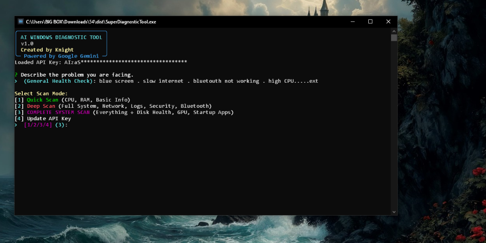

# SuperDiagnosticTool

<p align="center">
  
</p>

<p align="center">
  <strong>AI-Powered Windows Diagnostic &amp; Remediation Tool</strong>
</p>

<p align="center">
  <a href="https://github.com/Guettaf-hossam/SuperDiagnosticTool/releases"></a>
  <a href="https://github.com/Guettaf-hossam/SuperDiagnosticTool/blob/main/LICENSE"></a>
  <a href="https://github.com/Guettaf-hossam/SuperDiagnosticTool/stargazers"></a>
</p>

SuperDiagnosticTool collects real-time hardware telemetry, sends it to the Google Gemini API for analysis, and generates PowerShell remediation scripts to address detected issues. It includes multiple validation layers that a generated script must pass before the user is prompted to execute it.

---

## Screenshots

<p align="center">
  
</p>

*Main interface showing scan mode selection and problem description input*

---

## Key Features

### Universal Hardware Support
- **Dynamic Scaling:** Automatically adapts to any CPU configuration (1-128+ cores)
- **Hardware-Agnostic Logic:** Works on legacy systems (Intel Pentium) through high-end workstations (AMD Threadripper, Intel Xeon)
- **Graceful Fallbacks:** Safe handling of unsupported hardware queries (CPU frequency, battery, swap memory)
- **Low-Spec Optimized:** Lightweight execution to avoid resource pressure on constrained hardware

### Intelligent AI Analysis
- **Google Gemini Integration:** AI-powered system analysis and diagnostics via the Gemini API
- **Context-Aware Recommendations:** Correlates user-reported issues with collected system telemetry
- **Security Auditing:** Scans for suspicious processes, resource leaks, and potential malware indicators
- **Post-Fix Verification:** Generates completion reports distinguishing automated fixes from items requiring manual attention

### Multi-Layer Safety Architecture

Scripts generated by Gemini pass through four sequential checks before the user is asked to approve execution:

#### Validation Pipeline
- **Knowledge Base Matching:** Cross-references AI solutions against a set of tested, known-good remediation patterns
- **Dry-Run Simulation:** Previews all intended changes (services, files, registry) before any modification occurs
- **Script Validation (`ScriptValidator`):** Three-level check — blacklist (hard block on destructive patterns), suspicious pattern detection (alias and obfuscation-aware), and risk scoring on a 0-100 scale
- **Critical Path Interception (`CriticalPathInterceptor`):** Zero-trust gate that halts any script touching HKLM/HKCU registry keys or System32 paths until the user explicitly confirms

#### Safety Limits
- **System Restore Points:** Created automatically before any modification
- **Pre/Post Execution Snapshots:** Full system state capture to detect and log every change made
- **Rollback Generation:** Auto-generates a selective rollback script if execution fails
- **Execution Logging:** Every action logged with timestamps to `%TEMP%\superdiagnostic_execution_*.log`

#### PowerShell Execution
- **Admin Privilege Verification:** Scripts check for elevation before proceeding
- **Variable Sanitization:** Regex-based escaping preserves `$env:` variables without syntax errors
- **Service Safety Checks:** Verifies service existence before any Start/Stop/Set operation
- **Monitored Execution:** Scripts run via `subprocess.run` with a hard 5-minute timeout, full stdout/stderr capture, and automatic temp-file cleanup. This is direct host-level execution, not VM or container isolation. The validation layers above are the primary safety boundary.
- **Error Handling:** PowerShell wrapper includes try/catch/finally blocks with per-line error reporting

### Comprehensive System Scanning
- **Performance Metrics:** CPU usage (overall + per-core), memory breakdown, top resource consumers
- **Network Intelligence:** Active interfaces, DNS configuration, Wi-Fi signal strength, connectivity tests
- **Security Integrity:** Antivirus status, firewall profiles, Windows Update history
- **Hardware Health:** Disk SMART status, GPU information, battery status (laptops)
- **System Services:** Startup applications, failed services, critical event logs
- **Process Auditing:** Identifies processes with unusual resource usage or file locations

### Human-Centric Reporting
- **Professional HTML Reports:** Dark-themed, responsive diagnostic reports with visual metrics
- **Past-Tense Completion Language:** Reports use `[FIXED]`, `[CLEANED]`, `[DISABLED]` tags to reflect completed actions
- **Manual Attention Section:** Clearly separates automated fixes from items requiring user intervention
- **Timestamped Archives:** All reports saved to `AI_Reports/` for historical tracking

---

## Quick Start

### Download

**[Download SuperDiagnosticTool.exe](https://github.com/Guettaf-hossam/SuperDiagnosticTool/releases/latest)** — Standalone executable (no Python required)

> The executable is unsigned. Windows SmartScreen will show a warning on first run. See [TRUST_GUIDE.md](TRUST_GUIDE.md) for how to proceed. If you prefer to verify before running, build from source instead.

### Requirements

- Windows 10 or Windows 11
- Administrator privileges (required for system telemetry and remediation)
- Google Gemini API Key ([Get free key](https://aistudio.google.com/app/apikey))

### First Run

1. Download and run `SuperDiagnosticTool.exe`
2. Enter your Google Gemini API key when prompted
3. Describe your system issue
4. Select scan mode (Quick / Deep / Complete)
5. Review the AI analysis and the generated remediation script
6. Approve execution or view the detailed HTML report

---

## Installation (For Developers)

### Prerequisites
- Python 3.8 or higher
- pip package manager

### Install Dependencies

```bash
pip install psutil google-generativeai rich
```

### Run from Source

```bash
python super_diagnose_v2.py
```

---

## Usage

### API Key Setup

**Option A: Interactive Input (recommended for first-time use)**
- The tool prompts for an API key on first run
- Key is stored securely via Windows DPAPI (`keyring`) when available

**Option B: Environment Variable**
```bash
set GEMINI_API_KEY=your_api_key_here
```

**Option C: Manual Key File**
Create `gemini.key` in the tool directory:
```
your_api_key_here
```

### Scan Modes

| Mode | Scans | Use Case |
|------|-------|----------|
| **Quick Scan** | CPU, RAM, Basic Info | Fast performance check |
| **Deep Scan** | System, Network, Security, Logs, Bluetooth, Processes | Comprehensive troubleshooting |
| **Complete Scan** | All of the above + Disk Health, GPU, Startup Apps | Full system audit |

### Example Workflow

```
1. Run the tool
   > SuperDiagnosticTool.exe

2. Describe your issue
   > High CPU usage and slow performance

3. Select scan mode
   > 3 (Complete System Scan)

4. Wait for AI analysis
   [Scanning system layers...]
   [Processing telemetry...]

5. Review the generated remediation script
   > Execute? (y/n)

6. View the HTML report
   > Open detailed report? (y/n)
```

---

## Technical Details

### Code Architecture
- Modular design — each diagnostic category is an isolated function
- Comprehensive error handling with try/except blocks throughout
- Hardware-agnostic queries with graceful fallbacks for unsupported features
- Standard Python docstrings on all public classes and methods

### PowerShell Script Generation
- Admin privilege verification before execution
- Regex-based variable escaping to prevent syntax errors
- Environment variables (`$env:TEMP`, `$env:PATH`) preserved correctly
- Safe service management with existence checks before every operation

### Gemini AI Integration
- Structured prompts with delimited sections (`[ANALYSIS_START]`, `[FIX_START]`) for reliable output parsing
- Context-aware analysis using the collected system telemetry snapshot
- Past-tense reporting convention for completed remediation actions

---

## Security & Privacy

### What stays on your machine
- All system scanning and analysis runs locally.
- No telemetry is stored on external servers by this tool.

### What is sent externally
- To generate AI recommendations, a telemetry snapshot (CPU load, memory, process names, event log entries, network state) is transmitted to **Google's Gemini API**.
- Your API key is included with every request to Google.
- Review [Google's privacy policy](https://policies.google.com/privacy) for how this data is handled on their end.

### Other security properties
- **API Key Storage:** Stored via Windows DPAPI (`keyring`) when available. Never committed to version control.
- **Admin Transparency:** Every remediation script is displayed in full and requires explicit user approval before execution.
- **Non-Destructive by Default:** Registry and file modifications require passing `CriticalPathInterceptor` and explicit user confirmation.
- **Open Source:** Full source code available for independent review under GPL v3.0.

See [SECURITY.md](SECURITY.md) for additional security documentation.

---

## Troubleshooting

### "API Key Invalid" Error
- Verify the key is correct and active at [Google AI Studio](https://aistudio.google.com/app/apikey)
- Check for hidden whitespace or newline characters in the key
- Ensure the key has Gemini API access enabled

### "Not Running as Administrator"
- Right-click the executable and select "Run as Administrator"
- Or allow the UAC prompt when the tool requests elevation

### "Module Not Found" Error (Python version)
```bash
pip install --upgrade psutil google-generativeai rich
```

### PowerShell Script Fails
- Ensure Windows PowerShell 5.1 or later is installed
- The generated script is saved to `AI_Reports/remediation.ps1` — review it manually for errors

---

## Building from Source

### Automated Builds (Recommended)

The project uses GitHub Actions to build Windows executables on version tag push:

1. Push your changes to the main branch
2. Create and push a version tag:
   ```bash
   git tag -a v1.0.2 -m "Release notes" && git push origin v1.0.2
   ```
3. GitHub Actions builds the `.exe` and creates a release automatically
4. Download from the [Releases page](https://github.com/Guettaf-hossam/SuperDiagnosticTool/releases)

See [RELEASE_PROCESS.md](RELEASE_PROCESS.md) for detailed instructions.

### Manual Build (For Testing)

```bash
pip install pyinstaller
pip install -r requirements.txt
python build.py
```

This creates `dist/SuperDiagnosticTool.exe` with embedded icon and dependencies.

### File Structure

```
SuperDiagnosticTool/
├── super_diagnose_v2.py       # Main entry point and diagnostic logic
├── build.py                   # PyInstaller build script
├── icon.ico                   # Application icon
├── .github/workflows/
│   └── release.yml            # Automated build and release workflow
├── docs/
│   ├── icon.png
│   └── screenshot_main.png
├── src/
│   ├── safety/                # Script validation and monitored execution
│   │   ├── validator.py       # ScriptValidator + CriticalPathInterceptor
│   │   ├── sandbox.py         # SandboxExecutor (monitored subprocess runner)
│   │   ├── dry_run.py         # DryRunSimulator
│   │   ├── restore_point.py   # RestorePointManager
│   │   ├── enhanced_monitoring.py
│   │   └── knowledge_base.py
│   └── security/              # CredentialVault (DPAPI-backed key storage)
├── AI_Reports/                # Generated HTML reports and remediation scripts
├── README.md
├── SECURITY.md
├── TRUST_GUIDE.md
├── LICENSE                    # GPL-3.0
└── .gitignore
```

---

## Disclaimer

This tool generates and executes PowerShell scripts that modify system services, configurations, and registry values. Before approving any remediation script:

- **Read the full script** — it is displayed before execution is allowed
- **Backup critical data** before running automated remediation
- **Test on a non-critical system** if the change scope is unclear

The author is not responsible for system damage, data loss, or unintended consequences resulting from use of this tool.

---

## Contributing

Contributions are welcome. To contribute:

1. Fork the repository
2. Create a feature branch (`git checkout -b feature/improvement`)
3. Commit your changes (`git commit -m 'Add improvement'`)
4. Push to the branch (`git push origin feature/improvement`)
5. Open a Pull Request

---

## License

This project is licensed under the **GNU General Public License v3.0** — see the [LICENSE](LICENSE) file for details.

Copyright (C) 2026 GUETTAF HOUSSEM EDDINE

---

## Author

**Guettaf Houssem Eddine**
Electrotechnics Engineering Student
Akli Mohand Oulhadj University, Bouira, Algeria
Email: hossam.guettaf@proton.me
GitHub: [@Guettaf-hossam](https://github.com/Guettaf-hossam)

---

## Acknowledgments

- **Google Gemini AI** for system analysis capabilities
- **psutil** for cross-platform system telemetry
- **Rich** for terminal UI rendering

---

<p align="center">
  <strong>Version 1.0</strong> | Last Updated: August 2026
</p>

<p align="center">
  Akli Mohand Oulhadj University, Bouira, Algeria
</p>
